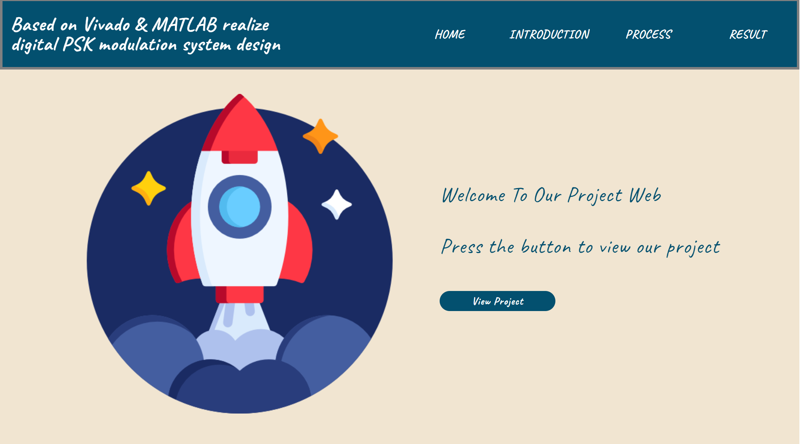
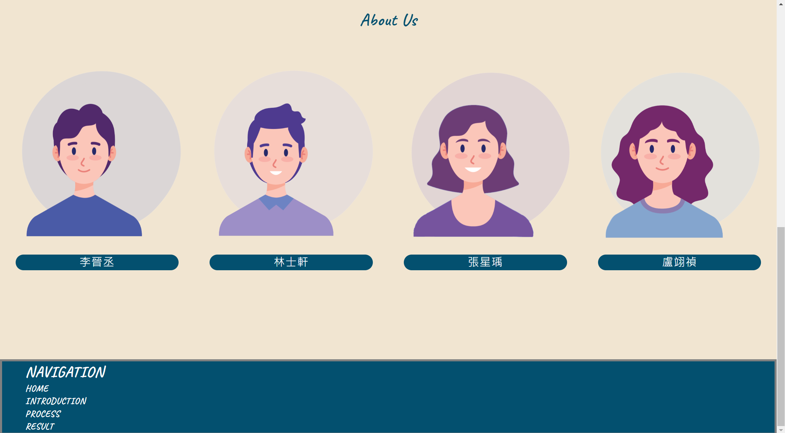
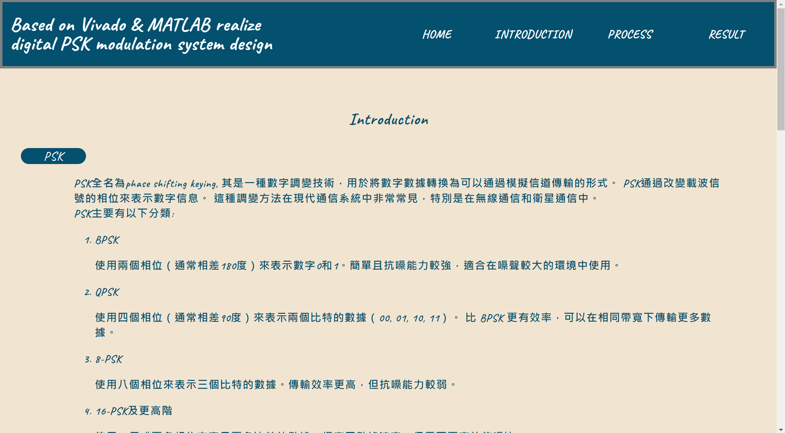
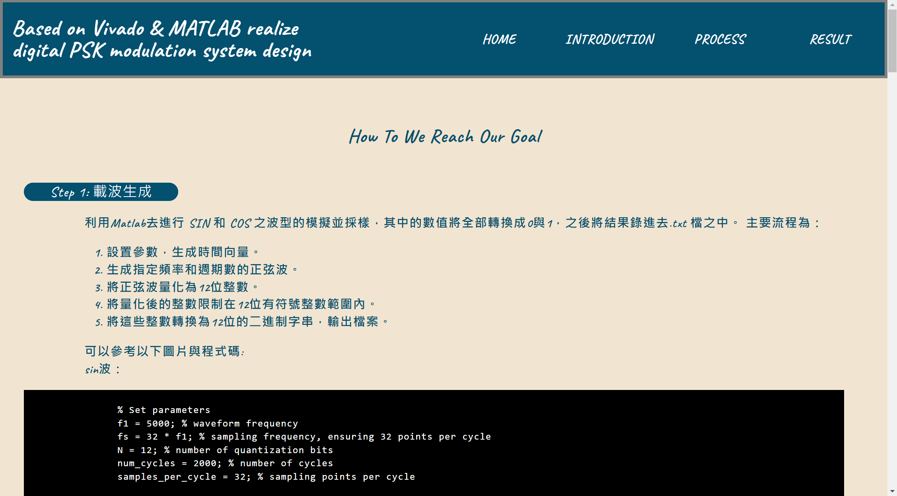
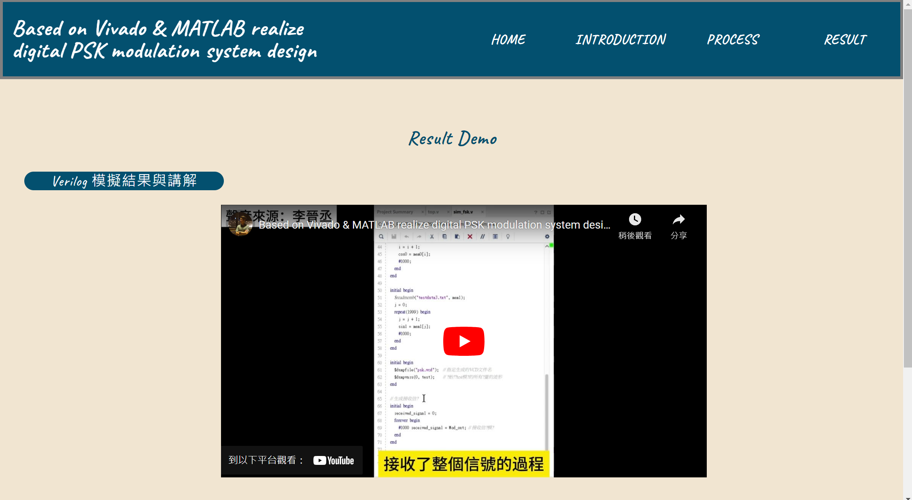

網頁展示
--
網站網址:https://snow200110.github.io/PSK.github.io/PSK.html

- 網頁字體設計:
    從google fonts中引入英文與中文字型，同時設定網頁一開始的背景顏色與字體顏色，CSS程式碼如下:
 ```css
@import url('https://fonts.googleapis.com/css2?family=Caveat:wght@400..700&display=swap');
@import url('https://fonts.googleapis.com/css2?family=Noto+Sans+TC:wght@100..900&display=swap');

* {
    background-color: #F1E5D1;
}

body {
    font-family: Caveat, "Not+Sans+TC", sans-serif;
    letter-spacing: 1px;
    margin: 0;
    color: white;
    line-height: 1.4;
}
```

- Home page

#### **功能介紹:**

主要可分成四個區塊，分別為header、 view project、about us與footer

- Header:  
  呈現題目主題與分頁按鈕，負責連結各個分頁，點擊文字即可以更換分頁，當滑鼠經過或停留在文字上文字顏色轉換成灰色，html程式碼如下:
```html
<header>
    <div class="wrapper-content">
        <h1 class="topic">Xilinx Vivado 實現數位 PSK 調變系統設計</h1>
        <nav class="header-nav">
            <a class="pagination" href="PSK.html" >HOME</a>
            <a class="pagination" href="Introduction.html">INTRODUCTION</a>
            <a class="pagination" href="process.html" >PROCESS</a>
            <a class="pagination" href="Result.html" >RESULT</a>
        </nav>
    </div>
    <br/>
    <br/>
</header>
```
 當滑鼠經過或停留在文字上文字顏色轉換成灰色，CSS程式碼如下:
```CSS
/*碰到分頁按鈕顏色轉成灰色*/
.pagination:hover{
    transition: all 0.3s;
    color: gray;
}
```

- View project:  
  主要視覺中心，有增加圖片與文字動畫，讓畫面更加生動，動畫是由下往上浮，html程式碼如下:  
```html
<section class="section-primary">
    
    <div class="wrapper-primary-text">
        <p class="primary-text">Welcome To Our Project Web</p>
        <p class="primary-text">Press the button to view our project</p>
        <a class="link-button" href="Result.html">View Project</a>
    </div>
</section>
```
   當滑鼠經過或停留在按鈕上，將轉換成灰色，CSS程式碼如下:
```CSS
/*碰到按鈕顏色轉成灰色*/
.link-button{
    text-align: center;
    background-color: #03506F;
    color:white;
    font-size: 50%;
    padding: 1% 10% 1% 10%;
    border-radius: 20px;
    border-color: none;
}
.link-button:hover{
    background-color: gray;
    border-color: none;
}
```

- About us:  
  組員Q版圖片與組員名字，於頂部的"About Us"文字同時也有從下往上浮的動畫  
```html
<section>
    <p class="about-content">About Us</p>
    <div class="wrapper-image-about">
        
        
        
        
    </div>
    <div class="teammember-about">
        <p class="member-detail">李晉丞</p>
        <p class="member-detail">林士軒</p>
        <p class="member-detail">張星瑀</p>
        <p class="member-detail">盧翊禎</p>
    </div>
</section>
```

    
- Footer:  
  方便使用者需滑到最上面去切換分頁，下方增加Navigation，點擊文字即可以更換分頁，當滑鼠經過或停留在文字上文字顏色轉換成灰色
```html
<footer>
    <div class="wrapper-content-footer">
        <div class="footer-list">NAVIGATION
            <a href="PSK.html" class="navigation-text-link">HOME</a>
            <a href="Introduction.html" class="navigation-text-link">INTRODUCTION</a>
            <a href="process.html" class="navigation-text-link">PROCESS</a>
            <a href="Result.html" class="navigation-text-link">RESULT</a>
        </div>
    </div> 
</footer>
```

- 網頁動畫:      
    動畫部分是利用ScrollReveal此網站所提供的程式碼，在HTML中JavaScript的寫法如下:
```html
<script>
    ScrollReveal({
        reset: true,
        distance: '60px',
        duration: 2500,
        delay: 300
    });
    ScrollReveal().reveal('.primary_main-img', { delay: 400, origin: 'bottom' });
    ScrollReveal().reveal('.wrapper-primary-text', { delay: 450, origin: 'right' });
    ScrollReveal().reveal('.about-content', { delay: 400, origin: 'bottom' });
</script>
```

<div style="text-align:center">
     
    <p>主畫面</p>
     
    <p>主畫面-組員介紹</p>
</div>
  
  <li style=" list-style-type: circle">Introduction</li>
  <h4> <strong>功能介紹:</strong></h4> 
  <p>此頁主要是介紹使用之器材與PSK之介紹，於頂部的"Introduction"文字同時也有從下往上浮的動畫</p>  
  <div style="text-align:center">
     
    <p>Introduction</p>
  </div>


  <li style=" list-style-type: circle">Process</li>
  <h4> <strong>功能介紹:</strong></h4> 
  <p>此頁主要是介紹實驗步驟與程式碼解析，於頂部的"Process"文字同時也有從下往上浮的動畫</p> 
  <div style="text-align:center">
     
    <p>Process 首頁</p>
  </div>  

  <li style="list-style-type: circle">Result</li> 
  <h4> <strong>功能介紹:</strong></h4> 
  <p>此頁負責展示實驗最後之結果，於頂部的"Result Demo"文字同時也有從下往上浮的動畫</p>  
  <div style="text-align:center">
     
    <p>Result Demo</p>
  </div> 

</ul>  
