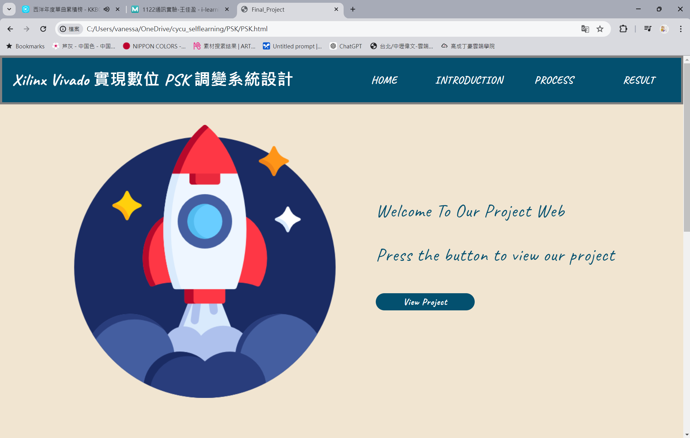
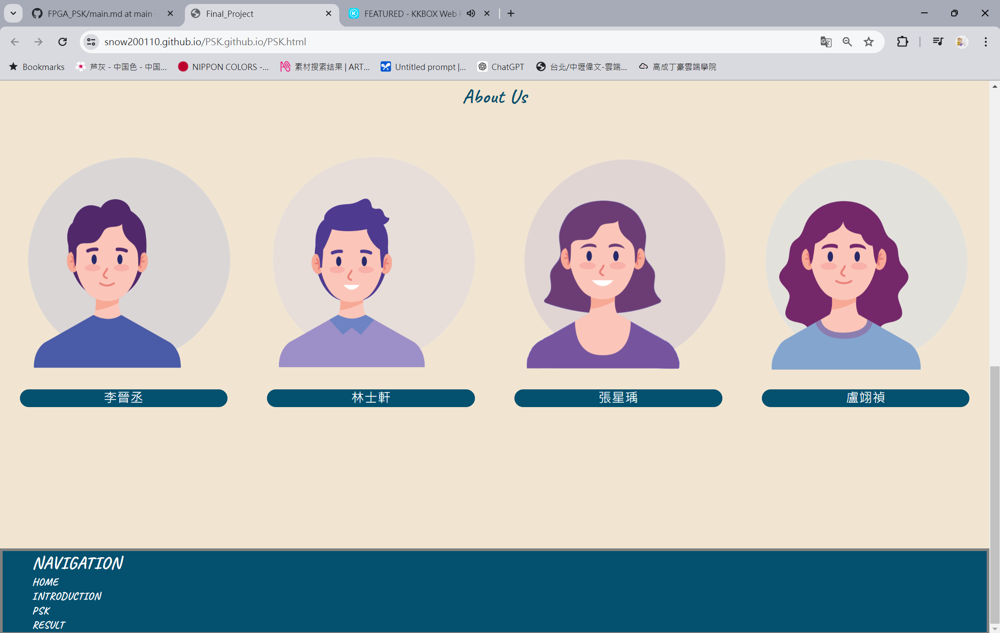
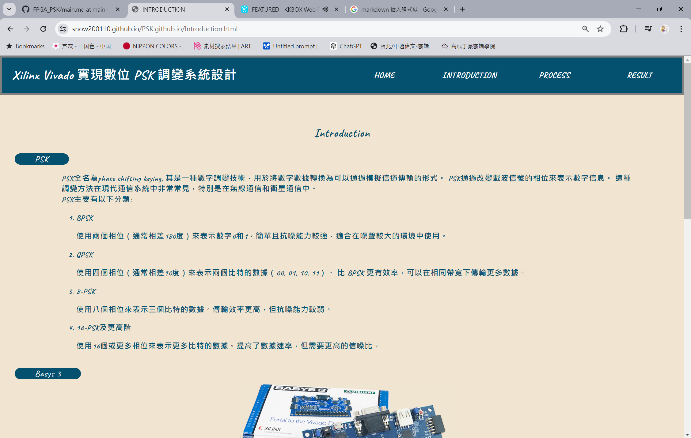
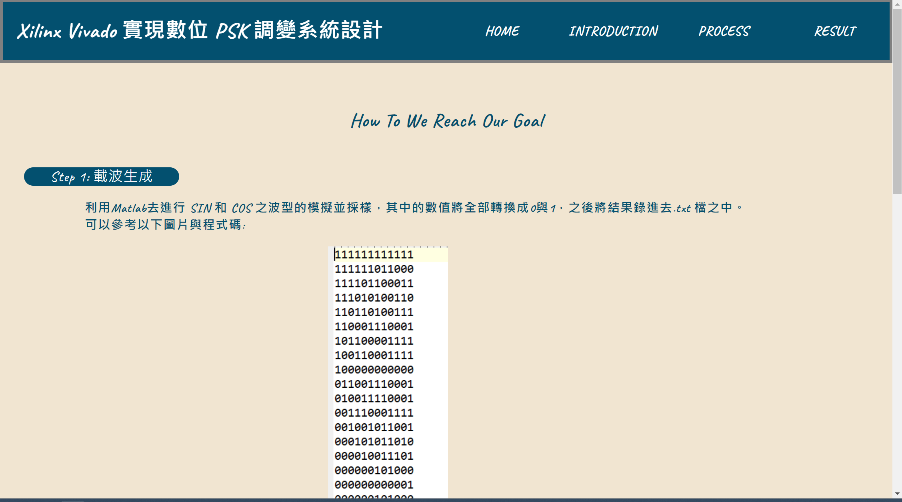
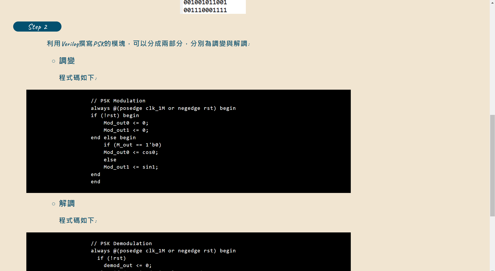
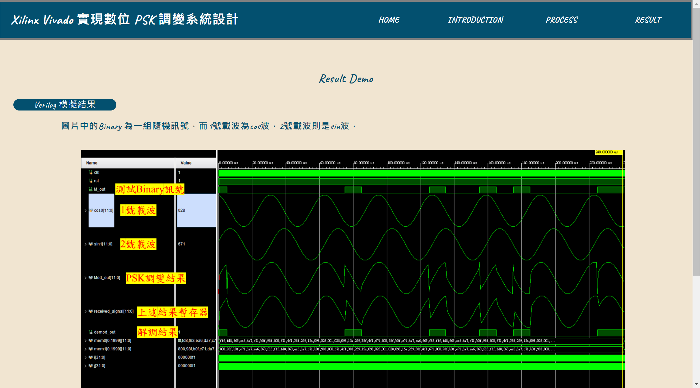

- ### 網頁展示: ###
<ul>
  <li style=" list-style-type: circle">Home page</li>
  <h4> <strong>功能介紹:</strong></h4> 
  
主要可分成四個區塊，分別為header、 view project、about us與footer

  <ul style="list-style-type:square">
    <li>Header:</li>
    
呈現題目主題與分頁按鈕，負責連結各個分頁，點擊文字即可以更換分頁，當滑鼠經過或停留在文字上文字顏色轉換成灰色

    <li>View project</li>
    
主要視覺中心，有增加圖片與文字動畫，讓畫面更加生動，動畫部分是利用ScrollReveal此網站所提供的程式碼
  
    <li>About us</li>
    
組員Q版圖片與組員名字，於頂部的"About Us"文字同時也有從下往上浮的動畫

    <li>Footer</li>
    
方便使用者需滑到最上面去切換分頁，下方增加Navigation，點擊文字即可以更換分頁，當滑鼠經過或停留在文字上文字顏色轉換成灰色

  </ul>
  
  

     
    
主畫面

     
    
主畫面-組員介紹

  

  
  
  <li style=" list-style-type: circle">Introduction</li>
  <h4> <strong>功能介紹:</strong></h4> 
  
此頁主要是介紹使用之器材與PSK之介紹，於頂部的"Introduction"文字同時也有從下往上浮的動畫
  
  

     
    
Introduction

  

  <li style=" list-style-type: circle">Process</li>
  <h4> <strong>功能介紹:</strong></h4> 
  
此頁主要是介紹實驗步驟與程式碼解析，於頂部的"Process"文字同時也有從下往上浮的動畫
 
  

     
    
Process 首頁

     
    
Process 其他內容

  
  

  <li style="list-style-type: circle">Result</li> 
  <h4> <strong>功能介紹:</strong></h4> 
  
此頁負責展示實驗最後之結果，於頂部的"Result Demo"文字同時也有從下往上浮的動畫
  
  

     
    
Result Demo

  
 

</ul>  
